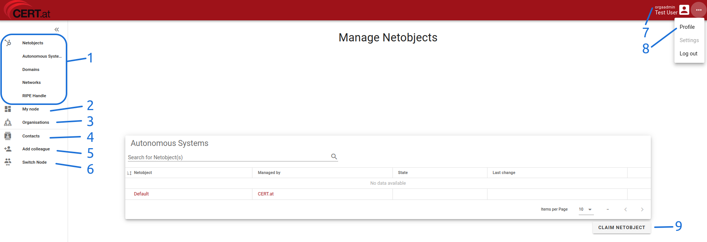

# First Steps

## Registration

You will receive an invitation email. Follow the link to set up your account. During this process,
you will be asked to create a password and set up a Multi-Factor Authentication app, along
with backup recovery codes. After completing the setup, you can log in to the Portal and access
your organisation's information.

Your password must meet the following criteria:

1. A minimum length of 16 characters.
2. At least one uppercase and one lowercase letter.
3. At least one digit and one special character.

You can later add physical keys as an MFA method in the [account management section](03_account.md#configuring-mfa-apps-and-devices).

!!! note

    The invitation email is valid for 72 hours. If it expires, you will need to request a new
    invitation from CERT.at.

## First Look at Tuency

<figure markdown="span"> _Start page of the Constituency Portal_</figure>

Upon your first visit to Tuency, you'll see a dashboard similar to the image above. The central
page defaults to the first tab of Netobjects, typically Autonomous Systems. Different elements
of the dashboard serve various purposes:

1. Tabs for managing different types of network assets.
2. _My Node_ allows you to view and manage users in your current organisation, tenant, or portal,
   depending on your role.
3. _organisations_ for managing organisations related to your role.
4. _Contacts_ where all contact information related to your organisation is located.
5. _Add Colleague_ to invite coworkers to help manage your organisation.
6. _Switch Node_ appears if you have roles in more than one organisation and allows switching
   between contexts.
7. A note indicating your privilege level in the current context.
8. _Profile_ for [managing your account](03_account.md), including password changes.
9. _Claim Netobject_ to request the addition of a new network asset to your organisation.
