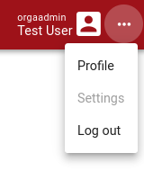
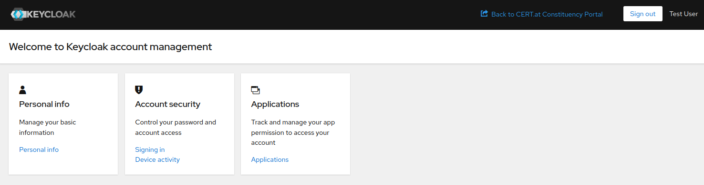

# Account Management

In the Constituency Portal, you can manage your account details. To access account management,
click on the _Profile_ link in the menu located in the upper-right corner.

<figure markdown="span">
_Click on_ Profile _to access account management._</figure>

Selecting _Profile_ redirects you to the account management page. We utilize
[Keycloak](https://www.keycloak.org/), a robust Identity and Access Management (IAM) tool, for
managing user accounts and securing access. All account management and sign-in activities occur
on the `login.cert.at` domain.

<figure markdown="span">
_View of the main account management page._</figure>

The account management section allows you to:

1. Update your email address and name in _Personal info_.
2. Adjust authentication settings, including passwords and MFA, under _Signing in_.
3. View active sessions and sign out from other devices via _Device activity_.
4. See a list of accessible applications, like the Constituency Portal, in _Applications_.

To return to the Portal, use the link in the upper-right corner.

!!! warning
    User management actions and activities within the Constituency Portal are thoroughly logged.
    Should you notice any suspicious activity on your account, change your credentials immediately
    and notify CERT.at for further investigation.

!!! note
    The domain `login.cert.at` is not directly accessible. Always use the link from the Constituency
    Portal to navigate to your account management settings.

## Configuring MFA Apps and Devices

During account setup, you'll configure an app for generating one-time codes. Additionally, within
the account console under _Signing in_, you can add physical security devices for authentication
or set up additional authenticator apps. We support most WebAuthn-compatible devices for physical
security keys.

!!! tip
    Changing the default MFA method (app or physical device) directly is not possible. The system
    defaults to the first method added. To use a physical key as the default, first add the key,
    then temporarily remove and re-add any authenticator apps. This makes the physical key the
    primary method. Note: removing recovery codes is not necessary.

!!! note
    MFA is a mandatory security measure in the Constituency Portal. Ensure at least one MFA method
    is active. Safely store your recovery codes to avoid being locked out of your account if you
    lose access to your device or app.
