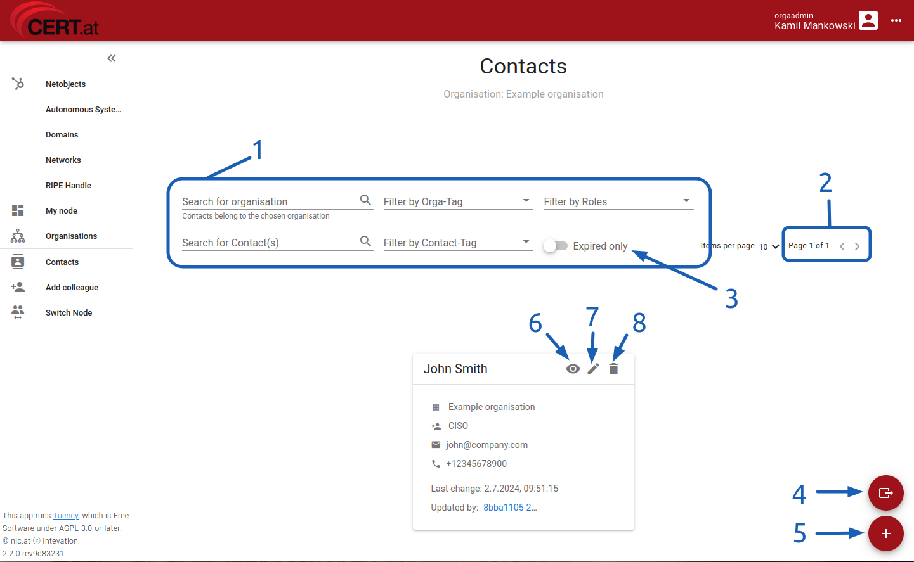
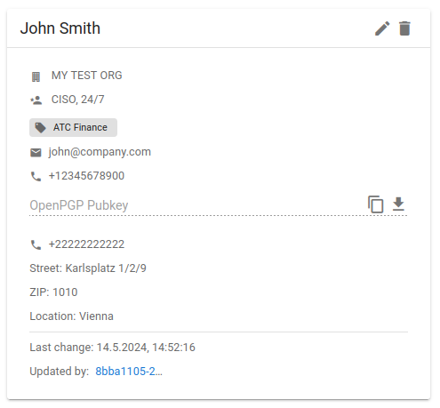
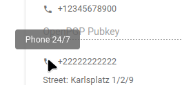
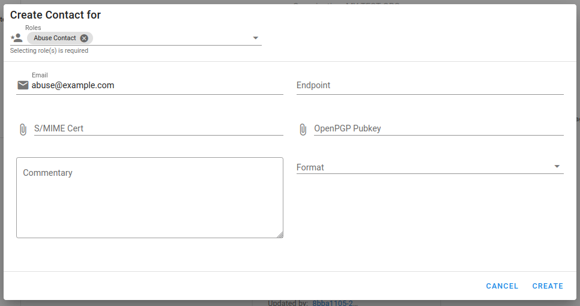
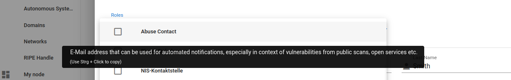

# Managing Contacts

Contacts store information utilized in various situations and are assigned one or more roles
dictating the required data. For instance, a _CISO_ role necessitates at least a phone number
 and an email address, while a _24/7_ contact must have a dedicated round-the-clock telephone number.

## Page Overview

<figure markdown="span"> _Contacts page overview_</figure>

The central part of the page displays cards of currently filtered contacts, providing a quick
overview of the available data. Additionally, you can find:

1. Fields to search and filter contacts.
2. Navigation buttons to browse through pages of results.
3. A toggle to show [expired contacts](04_reminders.md) only.
4. A button to export contacts.
5. A button to create a new contact.
6. Opening read-only view of the contact.
7. Opening edit form for the contact.
8. Deleting the contact.

## Understanding Contact Cards

<figure markdown="span"> _Example contact card_</figure>

Contact cards display detailed information. The header includes the contact's name with options
to edit or remove. The card’s center shows:

 - Company name,
 - List of roles applicable to the contact,
 - Assigned tags,
 - Email, phone numbers, and other contact details,
 - PGP keys, S/MIME certificates, and other files that can be downloaded or copied.

Hover over an icon to see the field name for data items like multiple phone numbers.

<figure markdown="span"> _Hover an icon to see the field name_</figure>

!!! note
    Tags such as `ATC Finance` are assigned by tenant or portal admins only. organisation admins may
    only view some tags.

## Adding a New Contact

1. Click the '+' button (4).
2. In the form that opens, first select the applicable roles for the contact. Available roles may
   vary by tenant.

    !!! note
        If you are managing multiple organisations in the current node, you must select one.
        Sharing contacts between organisations is not possible.

3. The form adjusts based on the roles selected. Each role determines required fields (marked in red)
   and optional fields.
4. If the role allows, you can attach files, such as keys for confidential communication or signed
   codes of conduct. Note these limitations:

    - Files must not exceed 10 MB.
    - For GPG/PGP public keys, only ASCII files are accepted.
    - For S/MIME certificates, x509 and PKCS#7 files in ASCII format are accepted
      (beginning with `-----BEGIN CERTIFICATE-----`).
    - All other documents must be in PDF format.

    !!! tip "Generating Accepted File Formats"
        To generate a **PGP/GPG public key** in the correct format, use the following command in
        a Linux environment. The resulting file `key.pub` should be uploaded.

        ```
        gpg --export --armor YOUR_EMAIL > key.pub
        ```

        For **S/MIME certificates**, if you received them in a binary form, convert them to ASCII
        using the `openssl` command. Replace `FORMAT` with `x509` or `pkcs7` as needed. Upload the
        final `certificate.txt`.

        ```
        openssl FORMAT -in PATH_TO_YOUR_FILE > certificate.txt
        ```

1. To save your changes, click the _Create_ button at the bottom of the form. You may need to scroll
   down to see it.

<figure markdown="span"> _Example minimal abuse contact_</figure>

## Understanding roles

Roles that can be set for a contact depend on your constituency, and are defined based
on functional or contractual requirements. To help you choose right roles, you will see
a short description when hovering a role name in the contact editing popup.

Note that some roles may trigger actions from our side, like subscribing to selected
mailing lists or creating an account in a MISP service. This will be mentioned in the role
description.

<figure markdown="span">
    _Example role description contact_
</figure>
