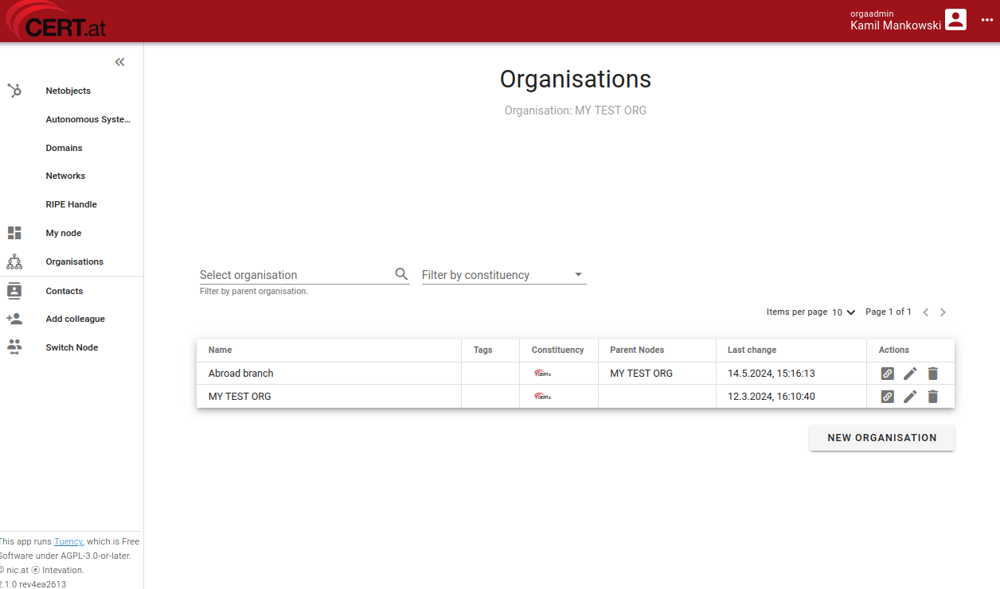

# Organisation Details and Administrators

As an orgadmin, you can modify basic details about your organisation,
manage suborganisations, and handle other administrators.

## Organisations Page

<figure markdown="span"> _Organisations page_</figure>

The _Organisations_ page displays all organisations within your current node, along with their tags,
constituencies, and parent nodes (the latter only for suborganisations).

In the _Actions_ column, you can access quick links to contacts and network assets and edit or
remove an organisation. Currently, orgadmins can only change the name of the organisation.

!!! danger
    Removing an organisation is irreversible. Please consult CERT staff before proceeding.

The _New Organisation_ button allows you to create new suborganisations.

### When to Create Suborganisations?

Suborganisations facilitate managing contacts and administrative access in larger organisations.
They allow you to assign specific contacts and invite orgadmins with access limited to them.
We recommend maintaining a small number of suborganisations and using them only when necessary.

To add new administrators to a suborganisation, please use the _My Node_ page.

## Managing Orgadmins

An organisation can have multiple administrators with equal rights. Administrators of a parent
organisation can manage suborganisations, but not vice versa.

### Quick Adding New Orgadmins - _Add Colleague_

You can quickly add new orgadmins through the _Add Colleague_ page. This feature allows you to
invite individuals to become an orgadmin for your current organisation. We recommend having at
least two orgadmins per organisation to ensure continued access if one becomes unavailable or
leaves the company.

The invitee will receive an email to activate their account.

!!! warning
    Adding a new orgadmin does not require approval from CERT.at. You control access to your
    organisation and are responsible for granting access responsibly.

    Decisions on suitable administrators should be made internally within the organisation.

### Managing Orgadmins - _My Node_

The _My Node_ page provides more control over admin invitations. It lists all individuals in your
current node, including those in suborganisations. Here, you can edit their assignments or remove
them. The _New User_ button allows you to invite administrators and specify their organisation
assignments, including suborganisations.

!!! info "Recovering Access"
    You cannot manage other orgadmins' credentials or data. For access recovery, orgadmins should
    use self-service methods such as _Forgot Password_ and MFA recovery codes. If these methods
    are insufficient, contact CERT.at staff.

    If you suspect an account has been compromised, remove the affected orgadmin from the
    organisation and immediately inform CERT.at.
