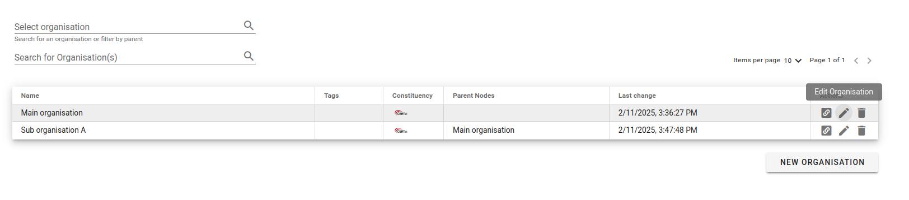
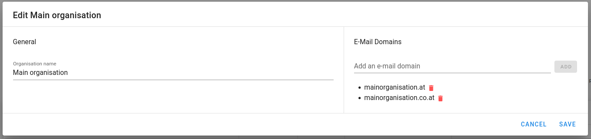
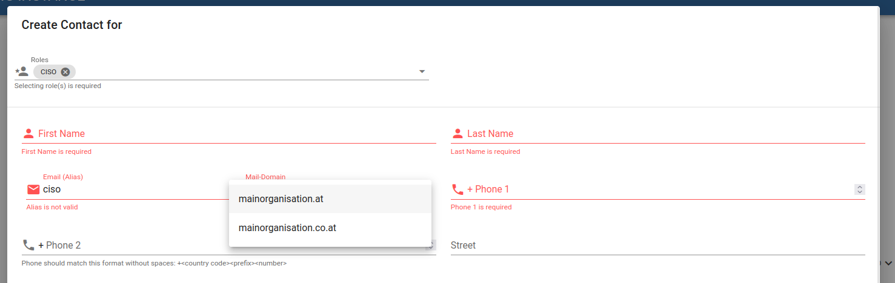
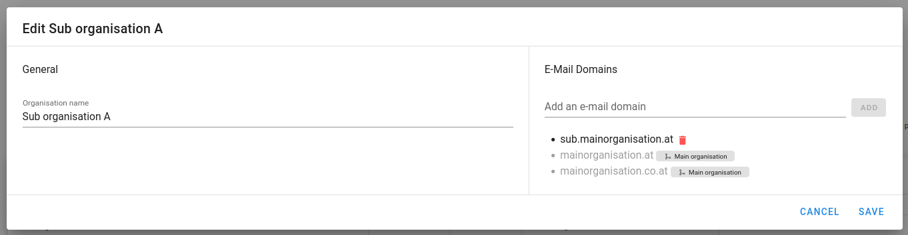

# Restricting Email Domains

To prevent typos in email domains, you can configure a list of allowed domains
for contact email addresses.

To enable this feature, go to the *Organisation* tab and click the edit
button next to the organisation you want to modify.

<figure markdown="span">
     _Selecting an organisation to edit_
</figure>

In the popup that appears, add the domains that should be allowed and click on *Save*.

<figure markdown="span">
     _Adding allowed email domains_
</figure>

Once enabled, when creating or editing a contact, the email fields will be split
into an alias field and a dropdown for selecting an allowed domain. Manually typing
a domain will no longer be possible.

<figure markdown="span">
     _Selecting contact email domain_
</figure>

!!! warning
    Existing contacts are not validated when enabling or modifying allowed domains.
    However, if you attempt to edit a contact with an unapproved domain, validation
    will fail until the email address uses an allowed domain.

## Suborganisations

When a parent organisation restricts email domains, all suborganisations inherit
these restrictions. However, suborganisations can add additional domains or enable
the feature independently without configuring domains in the parent organisation.

You can view the current state and inherited domains in the *Organisation*
tab by opening the edit popup for a suborganisation.

<figure markdown="span">
     _Email domains allowed for a suborg_
</figure>