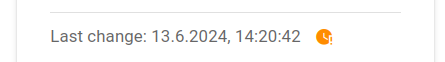
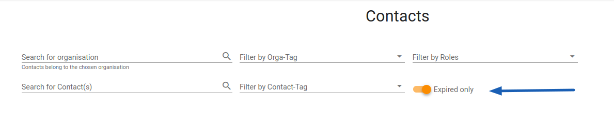
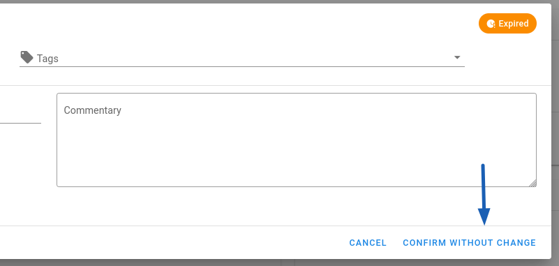

# Keeping Contacts Up-To-Date

In case of an incident, it's crucial to have correct and up-to-date contact information. To ensure
this, the Constituency Portal will send an email notification to orgadmins if their organisations
have contacts that haven't been updated for a long time.

!!! info "Notification Frequency"
    We do not like SPAM nor frequent emails. However, opting out from notifications is not possible
    as keeping contacts up-to-date is the main purpose of the Portal. To maintain a balance between
    information accuracy and the number of emails, we notify you:

    * Only **once a week**, on Monday morning.
    * About contacts that weren't updated in the last **90 days**.
    * If you don't update a contact after notification, we will remind you about this specific contact
      first in **30 days**.

## Finding Expired Contacts

The reminder email will inform you about the affected organisation and provide a short overview of
the roles that the expired contacts have. To find exactly which contacts need an update, open the
Contacts tab in the Portal.

Here, every expired contact is marked with an orange clock icon next to the *Last change* date.
Additionally, you can use a toggle switch to filter only expired contacts, allowing you to quickly
see all of them.

<figure markdown="span">
    
    _Every expired contact is marked next to the_ Last change _date_
</figure>

<figure markdown="span">
    
    _Use the filter on the_ Contacts _page to see only expired contacts_
</figure>

!!! tip
    You may find more expired contacts than mentioned in the email - this just means they expired
    after we generated the notification.

## Updating or Acknowledging Contact Data

Any change in the contact data refreshes the expiration timer. If the data is already correct, you
can click on _Confirm without change_ in the Contact Edit Form to refresh the _Last change_ date.
Once you change something in the form, the button is replaced by _Update_.

<figure markdown="span">
    
    _You can confirm data without making any changes_
</figure>
