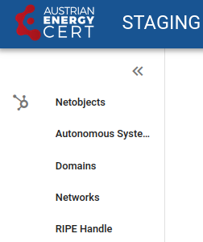
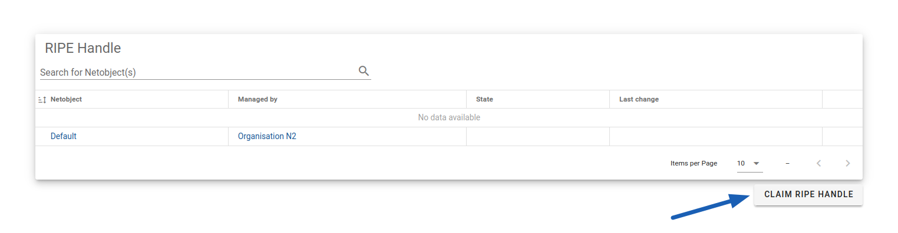
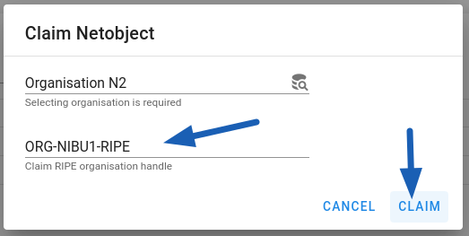
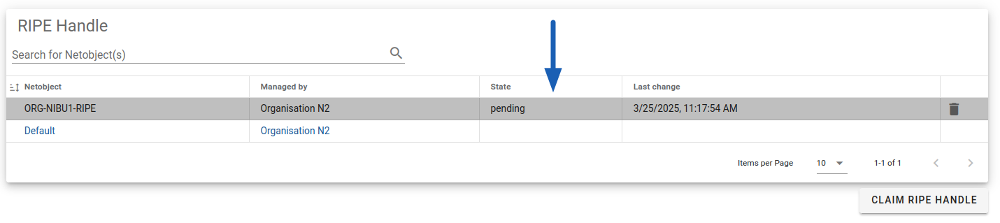
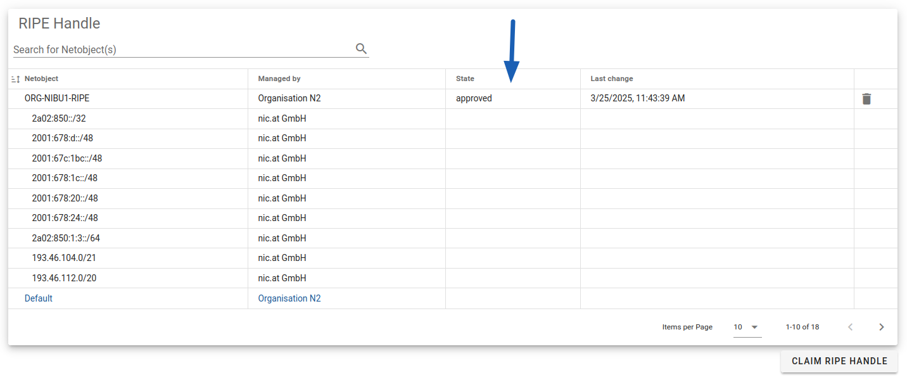

# Managing Netobjects

You can define following types of netobjects:

* Autonomous Systems
* Domains
* Networks (IP Ranges)
* organisation RIPE Handles

If your organisation has a RIPE handle, **we strongly recommend claiming it first**. Once
approved, all related AS and networks will be automatically populated and synced with changes in
the RIPE. It will also make the verification easier and quicker.

!!! info
    We update data sourced from the RIPE (e.g. IP ranges in AS) in the Constituency Portal
    once a day.

## Claiming a netobject

First, select the appropriate netobject type from the menu:

<figure markdown="span">
_You can claim AS, Domain, Network (IP Range) or a RIPE handle._</figure>

In the opened page, please click _Claim [type]_.

<figure markdown="span">
_Location of the button to claim a new object - for example, a RIPE handle_</figure>

Then provide the objects details. The expected format is:

* for Autonomous Systems - the object number, e.g. for AS123 type `123`
* for domains - fully qualified domain, the more generic the better, e.g. use
  `cert.at` instead of `tuency.cert.at` to handle all subdomains, if applicable
* for networks - a CIDR format defining the IP range with the network prefix, e.g. `192.168.0.0/24`
* for RIPE handles - an organisation handle in form `ORG-[id]-RIPE`, e.g. `ORG-sOm3-RIPE`

<figure markdown="span">
_Claiming a RIPE handle_</figure>

Right after claiming a new AS or RIPE Handle, you **won't** see the data populated from the RIPE. Your
object will be in _pending_ state until our administrators verify it:

<figure markdown="span">
_A claim is_ pending _until we approve it_</figure>

Once approved, you will see data populated from the RIPE. You will get an email notification when we
approve your claim.

<figure markdown="span">
_An approved claim shows related IP ranges. Note that they may be on more than a one page_</figure>

!!! info "Known Visibility Issues"
    When you have an approved RIPE Handle, you will see related ranges only on the _RIPE Handle_
    page; this includes all connected AS - even though you won't see AS numbers at that moment.
    Similarly, for directly claimed AS, you will see propagated IP ranges only on the
    _Autonomous System_ page.

    Both issues will be fixed in upcoming releases to make usage more intuitive.