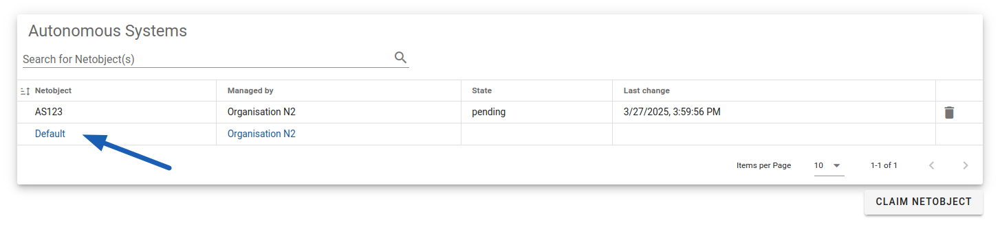
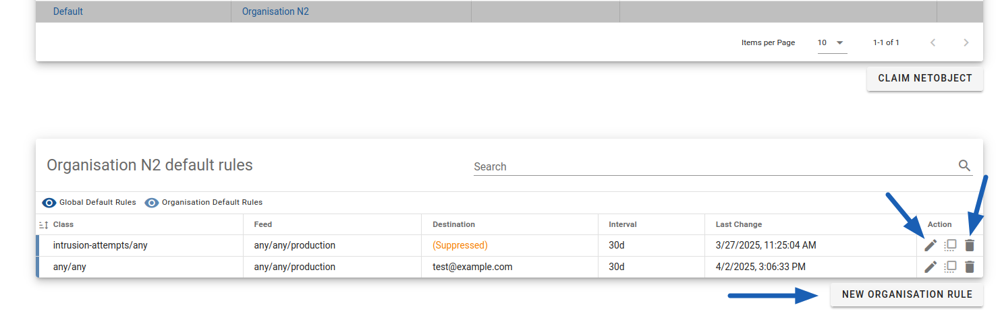
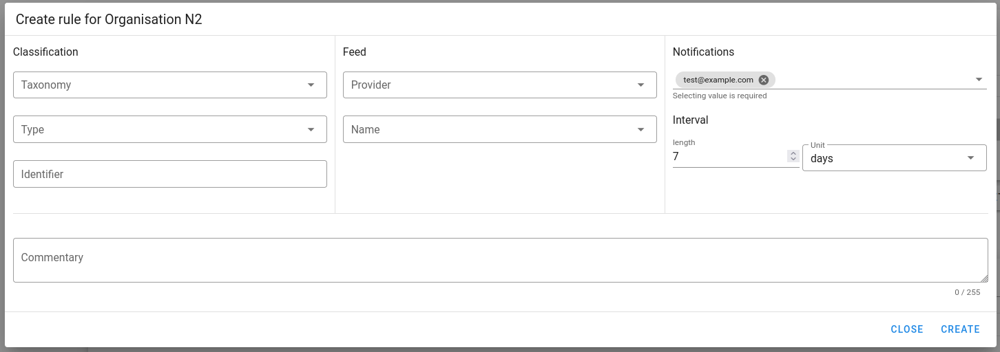
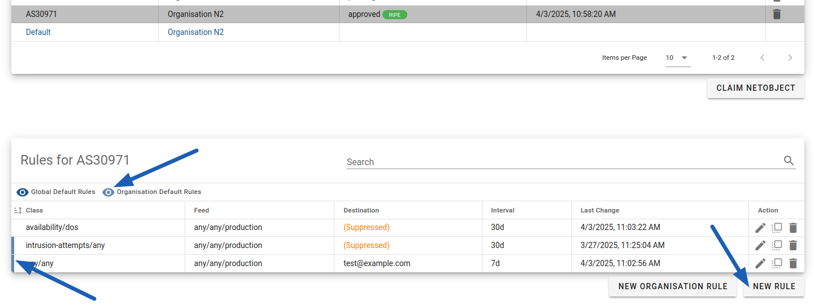
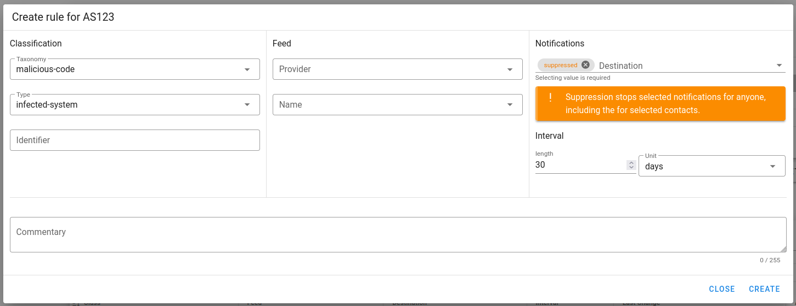
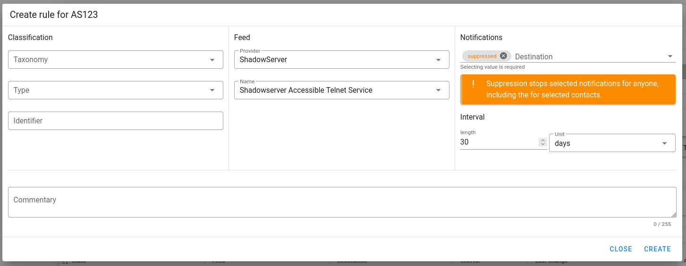
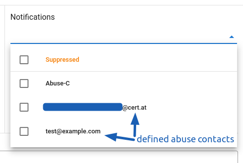
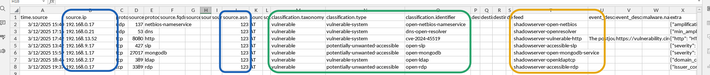

# Managing Notifications Rules

With approved netobjects, you can manage our notifications. Especially, for
any IP range, AS number or for the whole organisation, you can:

* disable notification of a given type, from a given source or of a specific identifier
* select right contact e-mail addresses
* select how often we should repeat a notification

## When and who do we notify?

Most of our source do their checks once a day and send us reports with the current state. We then
process the data, apply our filters, possibly enrich with additional information and find the contact
information based on the affected IP. By default, we use abuse contacts from RIPE database.

This process will see the same issue every day until it's solved. To prevent sending unnecessary
emails, we apply a few rules how often we can repeat the same information.
By default, for a given IP, we will repeat a notification:

  * if it still exists after 7 days - for notifications about **already compromised** systems,
  * if it still exists after 30 days - in other cases.

Finally, we send out emails with notifications grouped in bulks, **once a day** (excluding oneshot).

!!! warning "Recommended Priority Feeds"
    We recommend you to pay significant attention **at least** to data from the following feeds:

    * **_CERT.at One-Shot_** - notifications generated manually by our team for emerging issues
    * **_ShadowServer Compromised Website Report_** - information about already compromised HTTP(S)
        services, including e.g. firewall web interfaces
    * **_ShadowServer Compromised IoT Device Report_** - information about already compromised
        various IoT or OT devices connected to Internet
    * **_Shadowserver Vulnerable HTTP_** - warnings about detected critical vulnerabilities in HTTP(S)
        services, including e.g. firewall web interfaces, mail web servers and SSL-VPN gateways

!!! info "Feeds Limitations, CERT.at Warnings and Newsletters"
    In this service, we inform about events related to your network assets that are accessible
    online and could be remotely analysed by our partners. This is **not a comprehensive
    vulnerability assessment** nor a stream with all reported vulnerabilities. While we and our
    partners do our best, some false positives are also possible. If you have questions about
    notification you got, please see _[Emails von uns (DE)](https://www.cert.at/de/services/emails-von-uns/)_
    and don't hesitate to contact us at team@cert.at

    We also recommend you to subscribe to our newsletters:

     * [Warnungen (DE)](https://www.cert.at/de/meldungen/warnungen/)
     * [Aktuelles (DE)](https://www.cert.at/de/meldungen/aktuelles/)
     * [Tagesberichte (DE/EN)](https://www.cert.at/de/meldungen/tagesberichte/)

## Creating default organisation rules

You can use _organisation rules_ to suppress some notification for the whole organisation,
change default abuse contacts or the default repeating interval.

To create a rule, please go to any netobject management page, e.g. _Autonomous Systems_. Click on
 the _Default_ below your listed assets:

<figure markdown="span">
_Default row is available on every netobject page_</figure>

This will load a table with your current default rules.

<figure markdown="span">
_Table with current rules will be bellow the assets list_</figure>

On the right side, you can edit or delete a rule. Under the table you have a _New organisation rule_
button. Click on it to create a rule. You will see a popup as follows:

<figure markdown="span">
_New rule popup_</figure>

Here you can configure the rule. In the example above, the the default abuse contact address and
a shorter notification repeating interval has been set. Note that as the notification
 destination you can use any already defined contact with the _Abuse contact_ role.

In a section bellow you can find explanation for the available configuration.

!!! notice
    The rule is active from the moment you save it. However, because we may have already prepare
    some data for sending to you, you may notice some notifications using old configuration the day
    after creating or editing a rule.

## Creating notification rule for a netobject

If you want to manage notifications for a specific IP address, range or an AS, you need to
first [create the right netobject](./01_netobjects.md#claiming-a-subobject), and then click on it
to load all affecting rules.

You will then see together rules for the object as well as organisation rules - those are marked
by a colour border on the left side and can be hidden by clicking on the eye icon. By clicking on
_New rule_ button, you can create a new rule for the selected netobject only. Further the process is
 the same as for organisation rules.

<figure markdown="span">
_Rules for an object_</figure>

## Rule configuration explained

The rule configuration has three main parts:

* Classification
* Feed
* Notifications

You don't have to fill all fields, the empty fields will match any value. In addition, the comment
field is provided for your convenience - you can use it to note the reason of the rule to be able
to understand it later.

### Classification

We follow the taxonomy from [Reference Security Incident Taxonomy Working Group](https://github.com/enisaeu/Reference-Security-Incident-Taxonomy-Task-Force)
to categorize our events. This is a two-level (referred as _taxonomy_ and _type_) hierarchical
structure that categorize incidents in a standardize way. This let you easily manage similar events.
Please refer to [taxonomy page](03_taxonomy.md) for the list of available options.

The third field in the column is _identifier_. This refers to the **specific kind of an event**.
For example, it could
be a CVE number for vulnerabilities, malware family name for infections and mnemonic identifying the
software for reports about potentially unwanted public available services. There is no list of all
identifiers as they are partially dynamically generated. You can use it to filter out specific events
without disabling the whole category.

<figure markdown="span">
_Example configuration to suppress notifications about infected hosts in an AS_</figure>

### Feed

The _Feed_ section let you manage notifications based from whom we get it. You can select _Provider_
(e.g. [The ShadowServer Foundation](https://www.shadowserver.org/)) and then the very specific
_Feed_. Feeds usually (but not always) provide one kind of events, e.g. open Docker API, vulnerable
systems or malware infections.

<figure markdown="span">
_Example configuration to suppress notifications from a feed with open telnet instances_</figure>

!!! notice
    The list may not reflect all currently used feeds, especially there may be some previously
    used that are not active anymore. In addition, some partners may require from us not to disclose
    their identity.

!!! tip
    We describe feeds on [our website (DE)](https://www.cert.at/de/services/daten-feeds/), categorized
    by the taxonomy.

### Notifications

In this section, you can manage who should be notified and how often should we repeat a notification
(in case the given problem still exists). As destination, you can choose one or more from:

* _Suppressed_ - we will stop informing you about matching events,
* _Abuse-C_ - this will keep informing the abuse contact from RIPE database,
* any contact with _Abuse contact_ role defined for your organisation - see [managing contacts](../Managing_organisation/01_contacts.md).

<figure markdown="span">
_Available destinations_</figure>

If you suppress notifications, we will ignore any defined destinations and won't sent it to anyone.
Note that if you don't select _Abuse-C_, we will not use the RIPE abuse contact anymore for matching
events.

!!! tip
    We recommend managing filters on your own. If you need a more complex filtering than available
    in the Portal, you can contact us at team@cert.at and we will handle it for you.

## Finding information for a rule in notifications

The most common scenario is that you want to suppress some specific event that is a false positive
for your system, e.g. an intentionally open DNS resolver. You should get an e-mail notification from
us with a CSV file containing information as follows:

<figure markdown="span">
_CSV with marked columns useful for creating a rule_</figure>

You can use information marked with colours:

* blue - to create a netobject
* green - to filter based on classification
* orange - to filter based on feed

Assuming the DNS resolver listed in line 3 is intentionally open, you can simply create an exclusion
to prevent further notifications:

1. Create a netobject for `192.168.0.21/32` and start creating a corresponding rule.
2. For filtering, use:
    - _identifier_ set to _dns-open-resolver_ (you don't have to fill _taxonomy_ nor _type_) **OR**
    - select the feed provider _ShadowServer_ and the feed _Shadowserver DNS Open Resolver_
3. As destination, select _Suppressed_

!!! tip
    More about the CSV format you can read on [our website (DE)](https://www.cert.at/de/services/daten-feeds/)